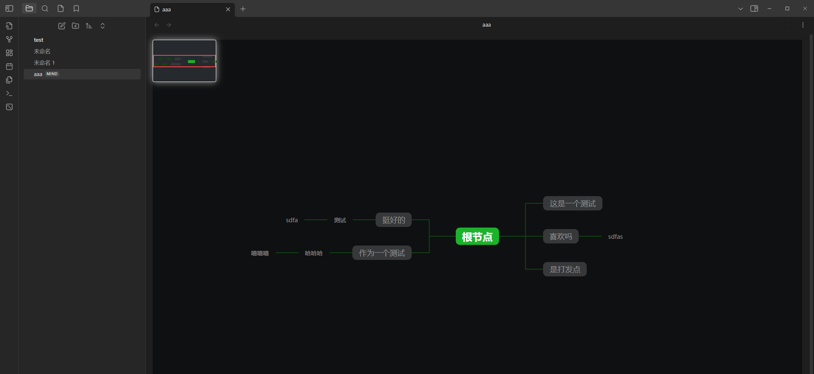
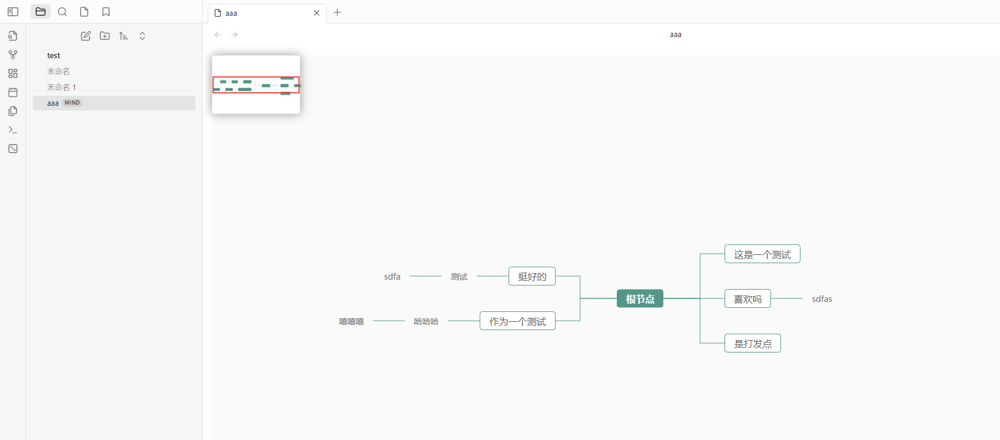
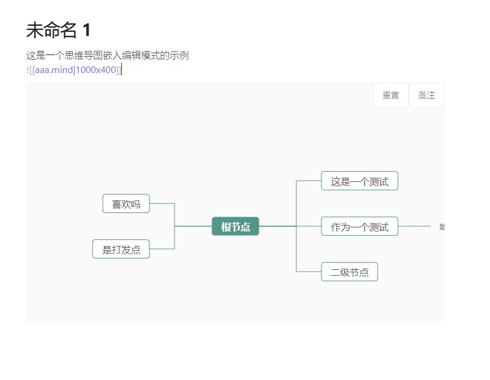
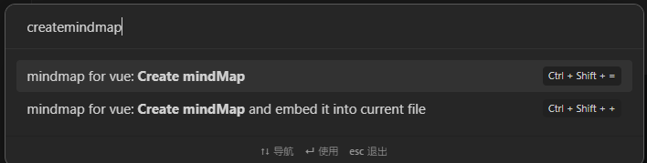

首先感谢并推荐此思维导图开源项目：https://github.com/wanglin2/mind-map

本项目只是站在巨人的肩膀上做了集成，一方面是个人喜欢这个思维导图项目，另一方面也希望向大家推荐它
# 介绍
本项目是一种obsidian的思维导图插件

通过命令创建单文件或直接嵌入当前文件

本项目主要是集成了 https://github.com/wanglin2/mind-map，
这是一个非常棒的完全开源的可本地化思维导图项目

感谢 @街角小林 的开源，希望大家多多过去点赞标星

# 功能
1. 单独编辑
2. 嵌入编辑
3. 预览
4. 根据主题切换深色与浅色（目前仅支持两种）
5. 小地图
6. 嵌入模式允许自定义嵌入高度
7. 为节点添加备注

# 使用
## 配置：
目前仅允许配置文件保存路径，不配置则默认与obsidian总附件目录设置一致
## 创建
目前提供了两种命令：
- create mindMap   创建单独的思维导图文件并跳转过去编辑
- create mindMap and embedd...  创建思维导入文件并嵌入在当前编辑页光标处

# BUG
- 鼠标不在画布中时，键盘也会影响画布内的操作
- 键盘方向键选择节点偶尔不好用，出现有些节点无论如何都选不到的情况（貌似simple-mind就有问题，不是嵌入导致的）
- simple-mind自带的快捷键貌似会被obsidian拦截导致无法使用
- 嵌入模式无法控制宽度（这实际上是现在故意写的，本人就喜欢宽度都100%）

# 后续工作
1. bug修复
2. 使用命令创建思维导图时
   1. 如果是嵌入模式，根据当前文件给思维导图命名,并将思维导图根节点命名为文件名；
   2. 如果是单独打开，允许通过弹出框输入文件名，并将思维导图根节点命名为文件名
3. 快捷键优化
4. 为节点添加备注
5. 为节点添加超链接
6. 为节点添加图标

